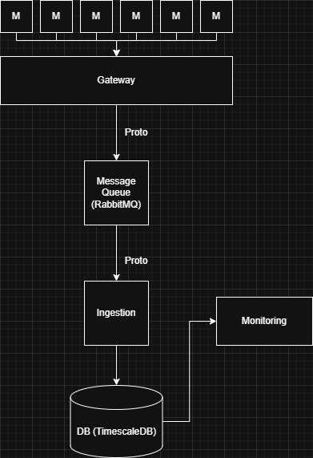

# Megapack Energy Monitoring Backend System

This project implements a realistic backend system for monitoring and managing Tesla Megapack energy storage units. It showcases a microservices architecture leveraging modern technologies to simulate data ingestion, processing, storage, and monitoring of a large-scale energy system.

## Project Overview

This project simulates a backend infrastructure designed to manage telemetry data from a fleet of Tesla Megapack energy storage units.  The system is built with a focus on:

*   **Realistic Simulation:** Emulating the data flow and challenges of a real-world energy monitoring system.
*   **Microservices Architecture:**  Employing a modular design with separate services for API Gateway, Data Ingestion, Monitoring, and utilizing RabbitMQ for asynchronous communication.
*   **Modern Technologies:**  Leveraging industry-standard technologies like Go for backend services, Python for simulation, Docker for containerization, RabbitMQ for message queuing, TimescaleDB for time-series data storage, and Protocol Buffers for efficient inter-service communication.
*   **Scalability and Resilience:** Designing for potential scalability and incorporating elements of resilience through message queuing and load balancing considerations.

## Key Features

*   **Realistic Megapack Simulator:**
    *   Python-based simulator emulates telemetry data generation from multiple Megapack units, reflecting realistic operational states (Charging, Discharging, Idle, Fault, Maintenance, etc.).
    *   Simulated data includes key metrics such as Megapack ID, State of Charge (SOC), power output, voltage, temperature, and operational state.
    *   Scalable simulation controlled via environment variables to simulate varying workloads.
*   **API Gateway (Go):**
    *   Entry point for telemetry data, built using Go for performance and concurrency.
    *   Receives and validates incoming telemetry data from simulators via HTTP.
    *   Utilizes RabbitMQ to asynchronously forward validated data to the Data Ingestion Service.
    *   Designed to be horizontally scalable and placed behind a load balancer (Load Balancer component to be added).
*   **Message Queue (RabbitMQ):**
    *   RabbitMQ acts as a message broker, decoupling the API Gateway and Data Ingestion Service.
    *   Provides buffering and ensures reliable message delivery, enhancing system resilience and responsiveness.
    *   Facilitates asynchronous processing of telemetry data.
*   **Data Ingestion Service (Go):**
    *   Consumes telemetry data messages from the RabbitMQ queue.
    *   Processes and efficiently stores the data in a Time Series Database (TimescaleDB).
    *   Built with Go for performance and efficient database interaction.
*   **Time Series Database (TimescaleDB):**
    *   Chosen for its optimized performance in handling time-series data, crucial for energy monitoring applications.
    *   Utilizes PostgreSQL as its foundation, offering robust SQL querying capabilities.
*   **Monitoring Service (Go):**
    *   Performs basic monitoring by querying recent data from TimescaleDB.
    *   Calculates and displays key performance metrics (e.g., request rates, data ingestion rates) to the console for basic system observability.
*   **Efficient Inter-Service Communication (Protocol Buffers):**
    *   Employs Protocol Buffers for communication between the API Gateway and Data Ingestion Service, enhancing efficiency and reducing bandwidth usage compared to JSON-based HTTP.

## Technologies Used

*   **Backend Services:** Go
*   **Simulator:** Python
*   **Containerization:** Docker
*   **Message Queue:** RabbitMQ
*   **Time Series Database:** TimescaleDB
*   **Inter-Service Communication (Data Format):** Protocol Buffers

## Architecture

The system follows a microservices architecture with distinct components working together to simulate a realistic energy monitoring backend:

1.  **Megapack Simulators:** Generate and send telemetry data.
2.  **API Gateway:**  Receives, validates, and forwards data asynchronously via RabbitMQ.
3.  **RabbitMQ:** Message broker for decoupling and buffering.
4.  **Data Ingestion Service:** Consumes messages and stores data in TimescaleDB.
5.  **TimescaleDB:** Time series database for efficient data storage.
6.  **Monitoring Service:**  Queries and analyzes data to provide basic system metrics.

## Future Enhancements

This project provides a solid foundation for a realistic energy monitoring backend. Future development could include:

*   **Robust Unit and Integration Tests:** Implementing comprehensive unit and integration tests to ensure code reliability and system stability.
*   **API Gateway Authentication:** Adding robust authentication mechanisms (e.g., API Keys, OAuth 2.0) to secure the API Gateway and control access to the system.
*   **Container Orchestration with Kubernetes:**  Developing Kubernetes manifests for deploying and managing the system in a containerized environment, demonstrating deployment readiness and scalability.
*   **Advanced Monitoring and Alerting:** Expanding the Monitoring Service to include more sophisticated metrics, rule-based alerting, and integration with visualization tools like Grafana.
*   **Control Service Implementation:**  Developing a Control Service to handle command requests and simulate control actions on the Megapack units, completing the closed-loop monitoring and control system.
*   **Load Balancer Integration:** Implementing a Load Balancer (e.g., HAProxy, NGINX) in front of the API Gateway to enhance scalability and high availability.

# Startup Instructions: 
- Run `docker-compose up --build`
